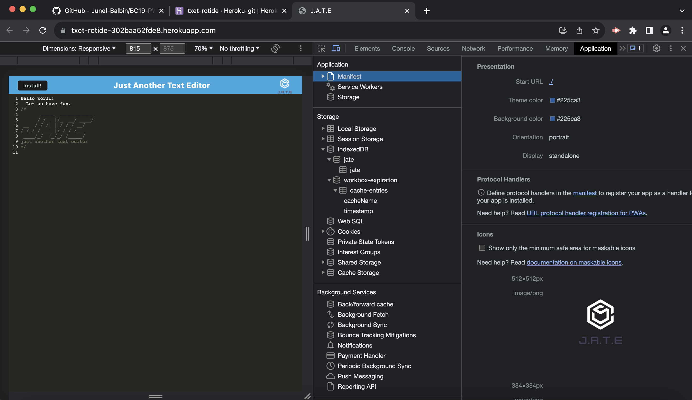

# BC19-PWA-Text-Editor

## 🌏 Table of Contents:
- [Description](#description)
- [Installation](#installation)
- [Usage](#usage)
- [Application UI](#application-user-interface)
- [Credits & Resources](#credits-and-resources)
- [Coded With](#coded-with)
- [Contributing](#contributing)
- [License](#license)

## Description:
* This Challenge Assignment involves building a browser-based text editor that operates as a single-page Progressive Web App (PWA). It incorporates various data persistence techniques to ensure redundancy in case of browser limitations. The application is designed to function seamlessly even when offline. The implementation leverages the idb package, a lightweight wrapper around the IndexedDB API.

### User Story:
```md
AS A developer
I WANT to create notes or code snippets with or without an internet connection
SO THAT I can reliably retrieve them for later use
```

## Installation:
* [Jate Text Editor: Deployed Heroku.](https://txet-rotide-302baa52fde8.herokuapp.com/)

## Usage:
* `git clone repository`
* `npm run start`
* `npm start`


## Application User Interface:


## Credits and Resources:
* Google search & Youtube videos.
* Mini Project 19: EdX and UCB.
* ChatGpt for troubleshooting.
* Stack Overflow & MDN.

## Coded With:
* IndexedDB.
* Webpack.
* Node.js.
* VS Code.
* Youtube.
* Heroku.

## Contributing:
* Any ideas or feedback is very much appreciated.

## License:
[](https://opensource.org/licenses/MIT)